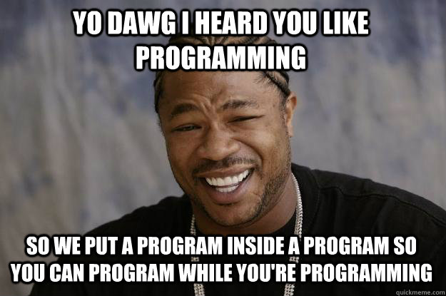

Brainfuck Intern: a program that learns to write Brainfuck programs
===================================================================

Starting with a bunch of randomly generated nonsense, this program "evolves"
a Brainfuck program to print a specific string of output through a
trial-and-error process that resembles natural selection.

|

I called it "brainfuck intern" because its approach to programming is similar
to most humans' approach when we first start programming (often as an
intern...): Change random things in the code until you get lucky and reduce the
number of errors.

Supported Platforms
===================

Linux only. Tested on Debian.

Dependencies
============

- Standard C lib. (glibc)
- C compiler (tested with GCC and clang)

Build
=====

Use the default Makefile target:

::

    make

The output will be an executable named ``bfintern``. Run it with no arguments
to see usage information.

Hello, world! by brainfuck intern
=================================

Brainfuck intern created this beautiful Brainfuck program after 20 minutes
of smashing random bits of garbage together. This program prints "Hello, world!"

::

    >-+-><--+-+->>++++-+++++++++++-++++++++++++-+-+++-+-<+++++++-++++-+--+++++-
    ++-+++++-+++++++++-++++--++--+-+++-++++-+++++-+-+++++--+-+-+--++++++++++-++
    +++++--+++--++-++++-+++-+++-++++-+-+++--++-++++-+-++-+-++.++++++++++++++-+-
    +--++++++-+-++++++--+++-+++++-++.++-++++++..--++++++-.+++>++-++-+--++++++++
    ++--+-+++++++-+++.------------.<++++-++.-------+--.++-++.------.-----+-----
    --+<+++++++-+--+>-+++++---+.-+--->+---++-+--++-+-++.--+++>[>+.<<<.+><.->[++
    +.>>++++.--<-<-<--++.-+++-+]]
